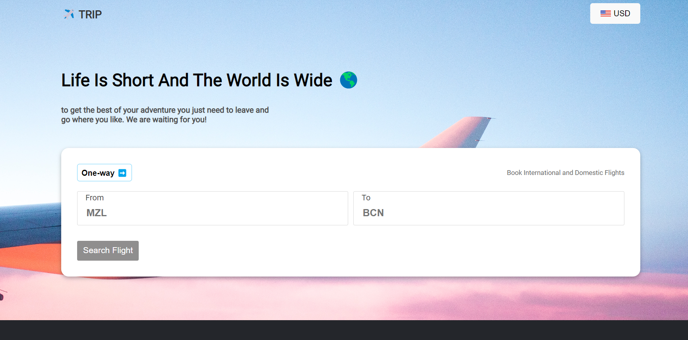

# Flights Booking web-app

**` Built with`**

[](https://skillicons.dev)


## Prerrequisitos

Antes de comenzar, asegúrate de tener instalado Angular CLI en tu entorno de desarrollo. Puedes instalarlo ejecutando el siguiente comando:
npm install -g @angular/cli

## Instalación

Sigue estos pasos para instalar y configurar el proyecto:

1. Clona este repositorio en tu máquina local:
 ```javascript
   git clone https://github.com/mvykool/newshore-test.git
 ```

3. Navega al directorio del proyecto:
```javascript
    cd test-app
```

3. Instala las dependencias del proyecto:
```javascript
    npm install
```
## Uso

Para ejecutar el proyecto, utiliza el siguiente comando:
```javascript
  ng serve
```
Esto iniciará la aplicación en modo de desarrollo y podrás acceder a ella a través de tu navegador web en [http://localhost:4200](http://localhost:4200).

## Pruebas unitarias

Puedes ejecutar las pruebas unitarias utilizando el siguiente comando:
```javascript
  ng test
```

Esto ejecutará los casos de prueba definidos en el proyecto y mostrará los resultados en la terminal.

## soluciones 

1 - problema: Modelado Clases
He creado este modelo para permitir la exportación de la clase Flight:
```typescript
export class Flight {
  departureStation: string;
  arrivalStation: string;
  flightCarrier: string;
  flightNumber: string;
  price: number;

  constructor(
    departureStation: string,
    arrivalStation: string,
    flightCarrier: string,
    flightNumber: string,
    price: number
  ) {
    this.departureStation = departureStation;
    this.arrivalStation = arrivalStation;
    this.flightCarrier = flightCarrier;
    this.flightNumber = flightNumber;
    this.price = price;
  }
}
```
Esta clase representa un vuelo y tiene las siguientes propiedades:

- departureStation: La estación de salida del vuelo (tipo string).
- arrivalStation: La estación de llegada del vuelo (tipo string).
- flightCarrier: La aerolínea del vuelo (tipo string).
- flightNumber: El número de vuelo (tipo string).
- price: El precio del vuelo (tipo number).
El constructor de la clase permite inicializar todas las propiedades al crear una nueva instancia de Flight.

Puedes utilizar esta clase para representar y trabajar con objetos de vuelo en tu aplicación. Asegúrate de importarla en los archivos donde la necesites.

#
2 - problema: Consumo REST API

Utilicé la primera URL por propositos de simplicidad, creé un servicio para llamar a la API:

Primero, importé las dependencias necesarias en mi servicio. Usé Injectable del paquete @angular/core para decorar mi servicio y poder inyectarlo en otros componentes de la aplicación.
```typescript
import { Injectable } from '@angular/core';
import { HttpClient } from '@angular/common/http';
import { Observable } from 'rxjs';
import { Flight } from '../models/flight.model';
import { environment } from '../../environments/environment';

@Injectable({
  providedIn: 'root'
})
export class FlightService {
  private baseUrl = environment.apiUrl1;

  constructor(private http: HttpClient) { }

  getFlights(): Observable<Flight[]> {
    return this.http.get<Flight[]>(`${this.baseUrl}/flights/0`);
  }
}
```
- Luego, utilicé un componente de formulario para obtener las entradas del usuario y realizar la llamada a la API basada en esas entradas.



#
3 - problema: Obtener Ruta

Almacené el origen y el destino en variables y utilizando una función recursiva llamada findRoute. Aquí está la explicación simplificada del código:

La función findRoute toma los siguientes parámetros:

- current: Estación actual en la búsqueda de la ruta.
- destination: Estación de destino buscada.
- flights: Arreglo de vuelos disponibles.
- route (opcional): Arreglo de vuelos que forman parte de la ruta actual.
- visited (opcional): Conjunto de estaciones visitadas para evitar ciclos.
El algoritmo de búsqueda de ruta funciona así:

Agrega la estación actual al conjunto visited.

Filtra los vuelos disponibles que tienen la misma estación de salida que la actual.

Itera sobre los vuelos filtrados.

Si la estación de llegada del vuelo coincide con la estación de destino, se ha encontrado una ruta completa. Se devuelve un objeto con el origen, el destino y los vuelos de la ruta.

Si la estación de llegada del vuelo no ha sido visitada, se llama recursivamente a la función findRoute desde esa estación.
Si no se encuentra ninguna ruta desde la estación actual, se retorna null.

Este código realiza una búsqueda exhaustiva de todas las posibles rutas desde el origen hasta el destino, evitando visitar las estaciones ya visitadas para evitar ciclos infinitos. Si encuentra una ruta completa, la devuelve; de lo contrario, retorna null para indicar que no se pudo encontrar una ruta válida.

#
4 - problema: Selección Moneda

**Resolví el problema utilizando la API Currency Converter de RapidAPI.** Aquí está una explicación simplificada del código:

- Creé un servicio llamado `CurrencyService` que se encarga de llamar a la API y realizar la conversión de moneda. El servicio tiene los siguientes métodos:
  - `setCurrency`: Permite establecer la moneda seleccionada por el usuario.
  - `getCurrency`: Devuelve la moneda actualmente seleccionada.
  - `convertCurrency`: Realiza la llamada a la API para obtener el tipo de cambio entre dos monedas.

- Utilicé un dropdown en la barra de navegación para permitir al usuario seleccionar la moneda deseada. El menú desplegable contiene diferentes opciones de moneda, cada una representada por un nombre y una imagen.


- Cuando el usuario selecciona una moneda diferente a USD, se llama al método `convertCurrencyTo` para realizar la conversión. Este método utiliza el servicio `CurrencyService` para obtener el tipo de cambio entre USD y la moneda seleccionada. Luego, el resultado se muestra dinámicamente en la interfaz de usuario.

- El código realiza la conversión de moneda en tiempo real utilizando la API Currency Converter. Permite al usuario seleccionar diferentes monedas y ver el valor equivalente de la ruta de vuelo en la moneda seleccionada.

